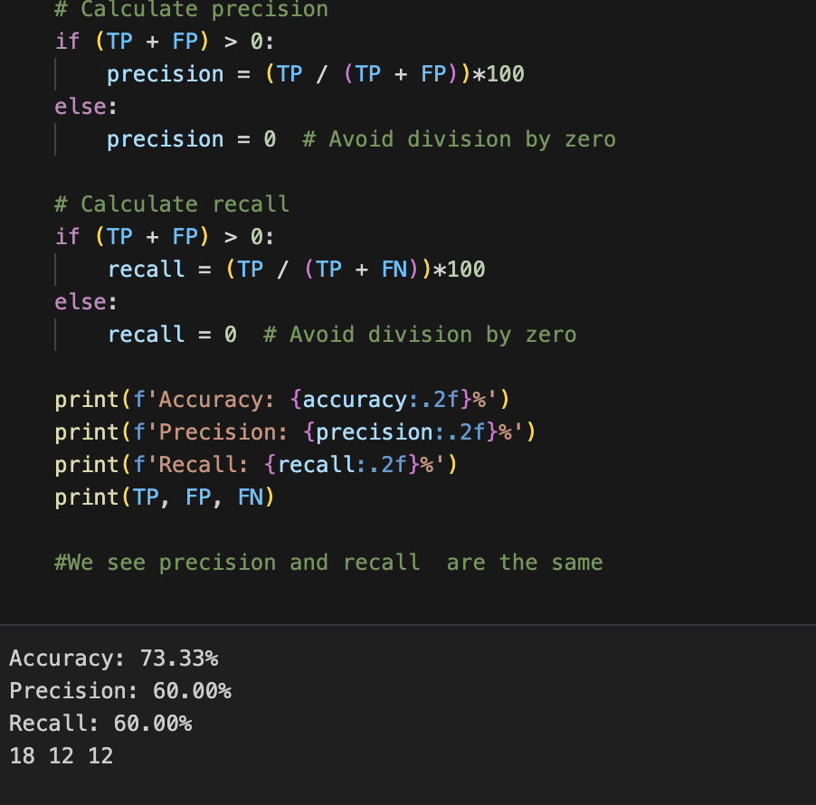

# Iris Logistic Regression

This code uses the Iris data set and performs a logistic regression on the data.
It will go through the encoding of the dependent variable. Splitting data into training
and test data and examine the accuracy of the predictions with a confusion matrix and the metrics;
accuracy, precision and recall.

## Authors
Eloise Morrison-Clare , Task provided by CoGrammer and HyperionDev

##Usage
Here’s an example of how to use the project:

1. Run the script.
2. View the output.




## Installation

The data is Iris.csv which is included in the repository. You can access the repositiory
using the following commands: 


```bash
# Clone the repository
git clone https://github.com/ejmc44/codingTasks.git

# Navigate to the project directory
cd codingTasks

# Install dependencies
pip install -r requirements.txt


